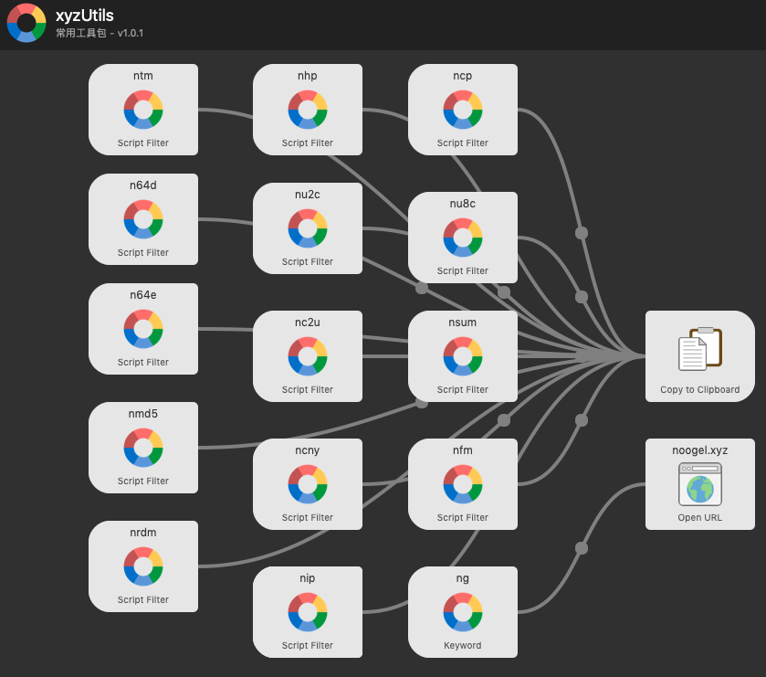
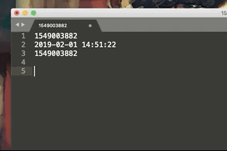

# Alfred-Workflow

开发工程师常用工具箱

## 全局预览

### 支持的功能及关键字

* `ntm` 时间戳转换，支持标准时间格式与时间戳自动检测转换，回车复制结果到剪贴板
* `n64d` Base64 解码
* `n64e` Base64 编码
* `nmd5` MD5 生成
* `nrdm` 随机字符串生成，输入长度
* `ncny` 数字转人民币大写
* `nu2c` Unicode 码转中文
* `nu8c` UTF-8 码转中文
* `nc2u` 中文转 Unicode 码
* `nip` IP 地址查询
* `ncp` 无格式粘贴
* `nsum` 简单数列求和
* `nfm` 简单格式化
* `nhp` 列出所有支持的命令
* `ng` 浏览作者博客

欢迎大家补充。

## Alfred 及 Workflow 的安装

1. [Alfred 官网](https://www.alfredapp.com/)下载安装，需要购买 Powerpack 后方可使用 Workflow 功能。
2. 下载文件后只需要双击 `Alfred-1.1.2.alfredworkflow` 文件即可安装并使用了。

## 使用教程

帮助查看命令 `nhp`

常用的时间格式转换命令`ntm`

编码转换命令 `nu2c`、`nc2u`、`nu8c`

其它命令欢迎探索。

## 关于作者

博客：[Noogel's notes](http://noogel.xyz)

Github：[Noogel's github](https://github.com/noogel)

---

> Update at 2019-02-01