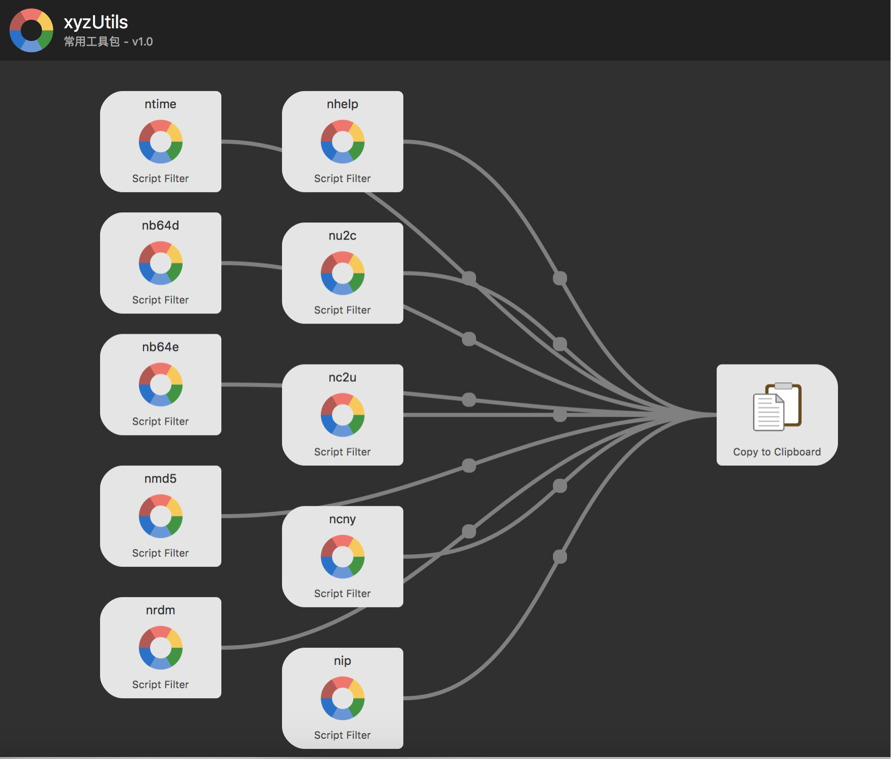
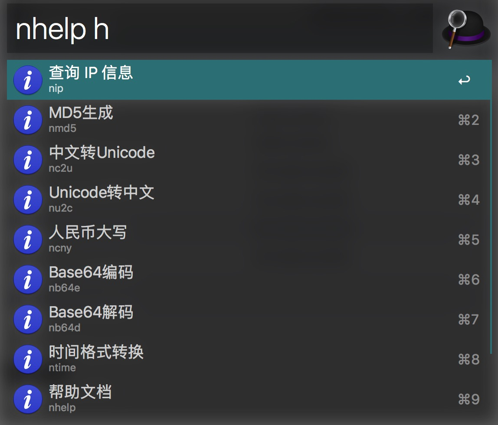

# Alfred-Workflow

开发工程师常用工具箱

## 全局预览

## 支持的命令

* `ntime` 时间戳转换，支持标准时间格式与时间戳自动检测转换，回车复制结果到剪贴板
* `nb64d` Base64 解码
* `nb64e` Base64 编码
* `nmd5` MD5 生成
* `ncny` 数字转人民币大写
* `nu2c` Unicode 码转中文
* `nc2u` 中文转 Unicode 码
* `nip` IP 地址查询
* `nrdm` 随机字符串生成，输入长度
* `nhelp` 列出所有支持的命令

#### 欢迎大家补充。

## 个人博客

[Noogel's notes](http://noogel.xyz)

## Github

[Noogel's github](https://github.com/noogel)

> Update at 2017-08-17